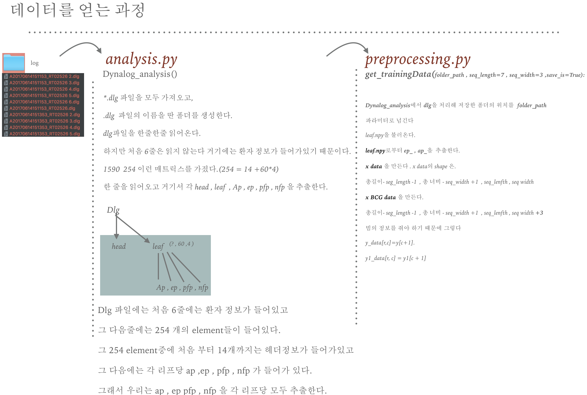

# dynalog_analysis

## 1.Dynalog Infomation 

## 2.Dynalog Preprocessing 

# Result
acc\leaf_num| 1 |2 | 3 | 4 | 5| 6 | 7 |8|9|10|11|12|13|14|15|16|17|18|19|
| ---  | --- | --- | --- | --- | --- | --- |--- | --- | --- | --- | --- | --- | --- | --- |--- | --- | --- | --- | --- | 
|default| 1 |2 | 3 | 4 | 5| 6 | 7 |8|9|10|11|12|13|14|15|16|17|18|19|
|with BCG| 1 |2 | 3 | 4 | 5| 6 | 7 |8|9|10|11|12|13|14|15|16|17|18|19|

acc\leaf_num|20| 21 |22 | 23 | 24 | 25| 26 | 27 |28|29|30|31|32|33|34|35|36|37|38|39|
| --- | --- | --- | --- | --- | --- | --- | --- |--- | --- | --- | --- | --- | --- | --- | --- |--- | --- | --- | --- | --- | 
|default|0| 1 |2 | 3 | 4 | 5| 6 | 7 |8|9|10|11|12|13|14|15|16|17|18|19|
|with BCG|0| 1 |2 | 3 | 4 | 5| 6 | 7 |8|9|10|11|12|13|14|15|16|17|18|19|

acc\leaf_num|40| 41 |42 | 43 | 44 | 45| 46 | 47 |48|49|50|51|52|53|54|55|56|57|58|
| --- | --- | --- | --- | --- | --- | --- | --- |--- | --- | --- | --- | --- | --- | --- | --- |--- | --- | --- | --- | 
|default|0| 1 |2 | 3 | 4 | 5| 6 | 7 |8|9|10|11|12|13|14|15|16|17|18|
|with BCG|0| 1 |2 | 3 | 4 | 5| 6 | 7 |8|9|10|11|12|13|14|15|16|17|18|
